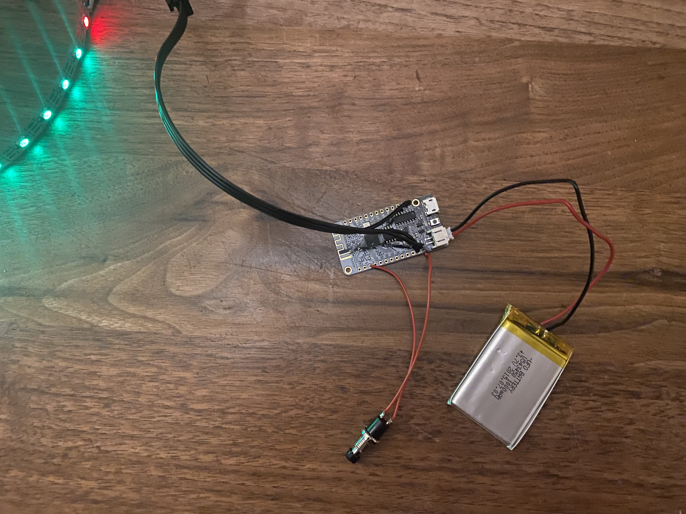
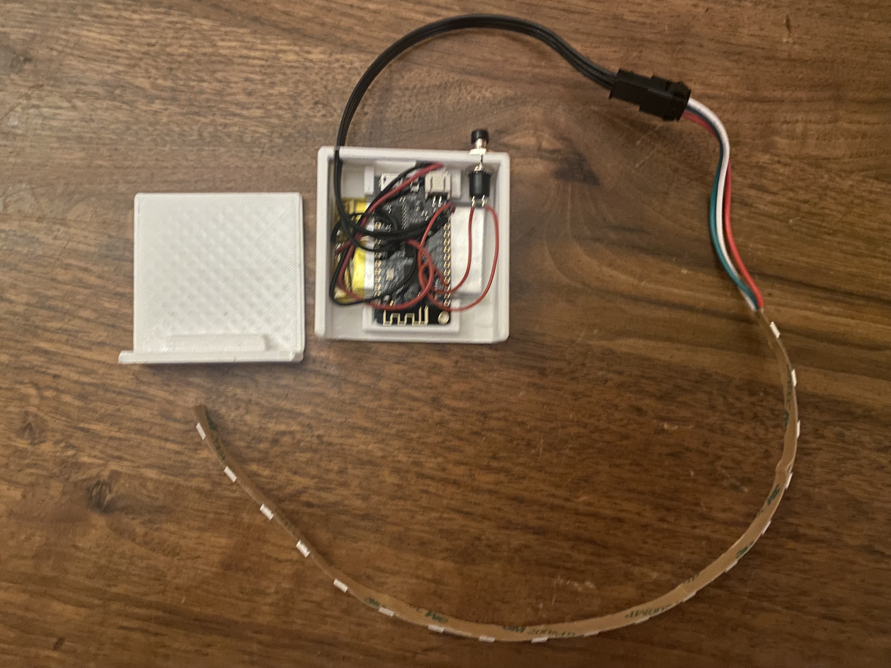
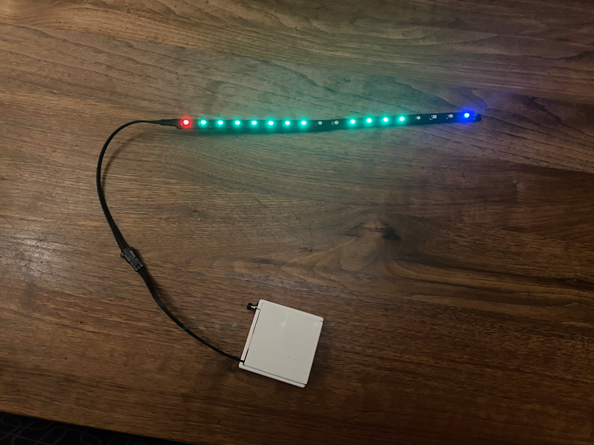

# Millisecond Gray code counter

This project drives an 18-LED NeoPixel strip to show a pattern that changes every frame. Moreover, each pattern will differ **in only one led** from the previous pattern.

This means that if you capture the strip with two cameras that _should_ be frame accurately synchronized you can determine whether this is actually the case: if the frame duration is less than `2**x ms` at most `x` LEDs may have a different value (or an indeterminate half-on-half-off value).

## Construction

As-is the project uses a _Lolin 32 Lite_ ESP32 board. This board was selected because it can be operated from a lipo battery, and has an on-board charger.

You need an 18 LED NeoPixel strip, 60 LEDs per meter or even 30 LEDs per meter preferred. Connect

- strip GND to Lolin GND, 
- strip 5V to Lolin GPIO 13 (_indeed!_), 
- strip DATA-IN to GPIO 12. 

Powering the strip through GPIO 13 will shut off power to the strip when the esp32 hibernates. This saves approximately 20mA (the neopixels use a little over a milliamp when powered and not active.

Build the project with `platformio` and flash it to the board. On reboot it should go through a full 65 second sequence.

You probably want a lipo battery, so you do not have to power the board. t is nice to have a pushbutton for _Reset_, connect between _EN_ and _GND_. 

Below is a picture of the assembled board:

If you want to get fancy you can 3D print a case. In directory `hardware/3dmodel` you find the needed files. You can directly print `Housing.stl` and `Lid.stl`, or you can import `SyncLedStripHousing.f3d` into _Fusion 3D` and modify it for your needs.

There is also a `LedStripBase.stl` and the accompanying `.f3d`, if you print two of these and glue the strip to it you can be sure they are in a straight line.

We have found that using a permanent marker to make the strips as black as possible (with the exception of the LED windows, obviously) helps detection.

Here is the complete result:

## Prepare for use

- Charge the lipo.
- Reset the board. It will start flashing.
- At the same time it will start a WiFi access point, and it will start a webserver on that wifi network. The network will be called something like `config-ledstrip` or `config-esp12345678`. This wifi network and webserver will disappear again when leds stop flashing, so you have about one minute to do the next steps. Try again if you fail to do it in time.
- Get a laptop/phone/tablet and connect to that open WiFi network.
- Open a webbrowser to `http://192.168.4.1`.
- Go to the graycounter configuration page.
- The most important parameter to set is _Target Frame Rate_. This should be the frame rate of your fastest camera. The ledstrip will change at twice this frequency.
- You may also want to change _Clapboard interval_, LED brightness, total sequence duration, some more.

Your settings will be remembered.

## Use

After you have configure the GrayCounter you are ready for taking measurements.
Charge the lipo.

When you `RESET` the board it will go through the whole sequence, and after that (just over a minute, by default) it will go to deep sleep. It will also power down the NeoPixel strip, so power consumption should be absolutely minimal (micro-amps).

The first and last LEDs are fixed: RED and BLUE. All other LEDs are either GREEN or OFF, and show the Gray code.

> Except for a _Clapperboard Pattern_ shown at an interval (default ever two seconds) when all LEDs will pight up in pink for the duration of two frames. These are very useful to get a first coarse-grained synchronization.

Maybe one day we will add the code to `cwipc_register` so that it can automatically find the LED strips in the captured RGB images, but for now you have do this yourself (you, the human):

- Capture a set of RGB images, one from each camera, that you expect to be synchronized.
- The gray codes changes every half-frame, so all cameras are expected to see the same pattern with one "LED of uncertainty"