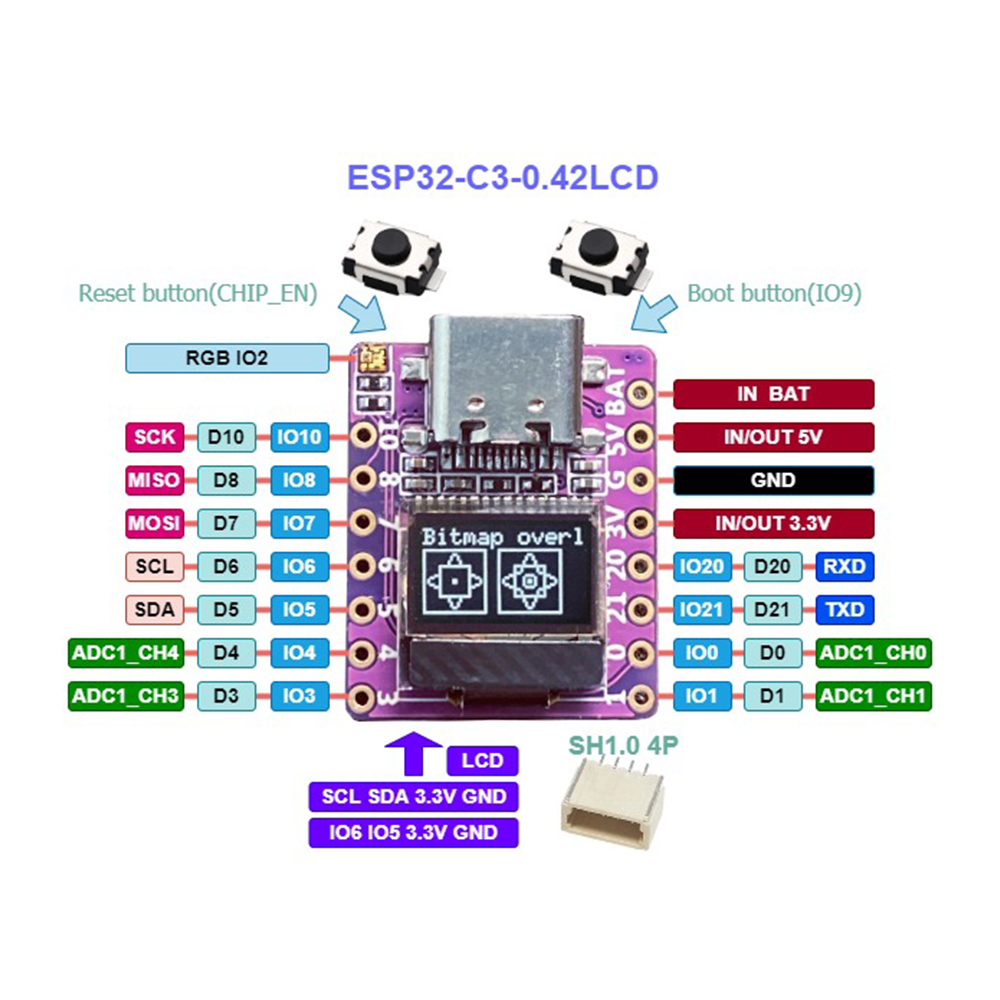

# Realsense Sync Tool

This project can be used to create a little USB-powered device that can be connected to the Intel RealSense D4xx sync signal.

It will display the frequency of the incoming sync signal (which should be produced by the RealSense camera that is in `MASTER` mode), in frames per second.

It can also output a "normal" Genlocked sync signal (5V, 33% duty cycle) that is in sync with the realsense signal. Optionally the realsense FPS can be divided by an integer factor (so 15FPS cameras can be synced to a 30FPS rRealsense setup).

The tool creates a WiFi Access Point, and it creates a website where the configuration can be changed.

## Construction

This project requires an ESP32-C3-0.42LCD board, which is a tiny board with an esp32c3 and a tiny LCD (as the name suggests). The board can be gotten on Banggood and such sites for a few euro (dollar, whatever), it has
a USB3 power connector and just enough I/O ports.

Here is a picture:


The board is described here: <https://github.com/01Space/ESP32-C3-0.42LCD>.

Pin 3 (`IO3`) is the sync input. It can be attached to a `1.8V` Realsense sync source, or a `5V` genlocked sync source.

Pin 0 (IO1) is the genlock sync output. Open drain, it can be connected with a `10K` pullup resistor to `5V` to get a `5V` 30% duty cycle genlock sync signel.

Pin 1 (IO0) is the realsense sync output at `3.3V`. You need to add a voltage divider with two `1Kohm` resistors to get a `1.6V` signal which is good enough to drive realsense cameras.

## Building the software

This is best done with `platformio` and `vscode`.
Open the current directory in vscode, it should help you to install platformio.

PlatformIO will then give you _Build_ and _Upload_ buttons on the bottom toolbar. When you use _Build_ it should automatically download all needed toolchains, frameworks, libraries, etc.

> The instructions are gotten from the `platformio.ini` file.

Then you connect your device to USB. The `Serial Monitor` tool in the bottom bar should connect to the device, it'll probably have some old version of this software, or maybe some default software.

Now you can use the `Upload` command to flash the new software to your device. This should all work automatically. If it doesn't you can force the device into usb-flash mode by pressing and holding the `Boot` button and then pressing and releaseing `Reset`. Then try the upload.

Once the device has been flashed it will boot to Iotsa, it has a default name and will create a corresponding WiFi network. The name will be something like `iotsa123456`, the Wifi network `config-iotsa123456`.

Connect to that WiFi network and visit `http://config123456.local` with your web browser. Give the device a name, let's say `syncer`. Reboot it (although it may do this of its own accord when you rename it).

It is now called `syncer.local` and it will create a WiFi network `config-syncer`.

For this device it is best to leave it at that, and not connect the device to you local WiFi network.

## Use

With a phone or laptop connect to the `config-syncer` network.

Visit `http://syncer.local`. Go to the synctool configuration page.

Here you can set where the input signal comes from:

- Realsense and GenLock are the same for now: both are on pin `IO3` rising edge),
- Free means the device creates its own sync signal, and you can set the free-running FPS.
- Divider can be used to set a divider between input sync and output sync.

The device display will show you the current incoming sync signal frequency and the outgoing sync signal frequency.

## Checking that it works

These instructions should go elsewhere, but I'll put them here for now.

- Create a `cameraconfig.json` for your realsense cameras with `cwipc_register --noregister`.
- Create a coarse registration with `cwipc_register --nofine --interactive --rgb` with the Aruco target.
  - If it cannot find the aruco target you may have to increase the color and depth width and height in `cameraconfig.json`, and/or change `map_color_to_depth`.
- No need for fine calibration just yet.
- Edit your `cameraconfig.json` and set `sync_master_serial=external`.
- Connect your `RSSyncTool` to your cameras with the sync cables and the dongels.
- Provide an input sync signal to the RSSyncTool (or set it to free-running).
- Run `cwipc_timing`. This will give you detailed timing information about all point clouds captured and all RGB and D frames used for those point clouds.
- First check is that the point cloud frame rate is as expected. If it is lower (or sometimes lower) then you should lower the framerate `fps` in the `cameraconfig.json`.
- When that's fine you should see that initially (the first few seconds) the RGB and D images used for the point cloud will be varying per camera, but after a few seconds everything should stabilise and you should see that all the timestamps used are the same.
  - Except that there is currently (3-Feb-2025) a bug that sometimes uses a frame that is one frametime too old for one of the cameras. This will be fixed.

### Bonus checks

If you also build the `../GrayCounter` device you can do even more checks to see that your cameras are in sync, and also that they are in sync with any other cameras in your system.

- Set the GrayCounter frequency to twice your wanted FPS.
- Put it somewhere where all cameras can see it.
- Start a capture.
- Press the _Reset_ button on the GrayCounter, which will make it run for one minute.
- Grab RGB image sequences off all cameras. For the realsenses, use
  
  ```
  mkdir tmp
  cwipc_grab --nopointclouds --rgb png --count 300 tmp
  ```
  
  This will grab 300 point clouds and throw them away, but it will store `png` images of every RGB capture of all cameras in the `tmp` directory.

- You can now inspect the corresponding captures of the cameras to ensure the Gray code is either identical or off by one bit at most.
  - But do remember that it takes a few seconds before the cameras are in sync, so you should start looking at capture 200 or so.
  - Every few seconds that GrayCounter will show solid pink for a few frame times. This is to make it easier to ensure that overall sync is somewhat correct. If you happen to have selected a frame to inspect that is in this "pink time" just select another one a few frames further.
  - How to find the corresponding capture of any other camera systems that should be in sync I leave to you:-)
  - There is currently (03-Feb-2025) a bug that causes the color channels to be mixed up in the RGB capture. You'll have to live with this until it is fixed.